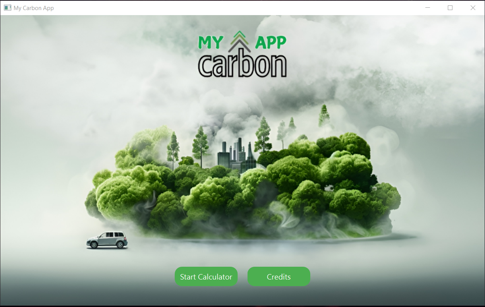
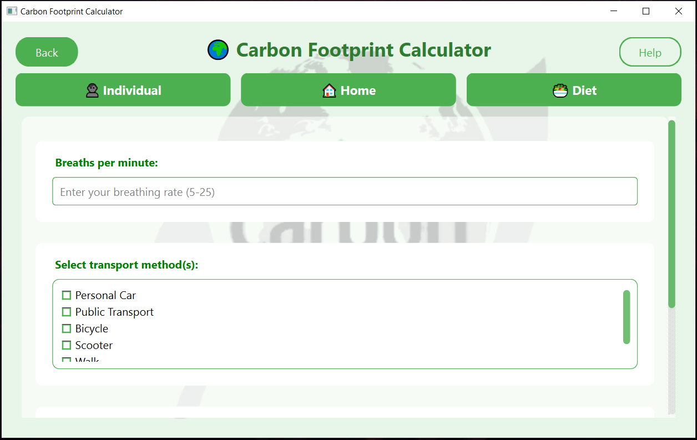
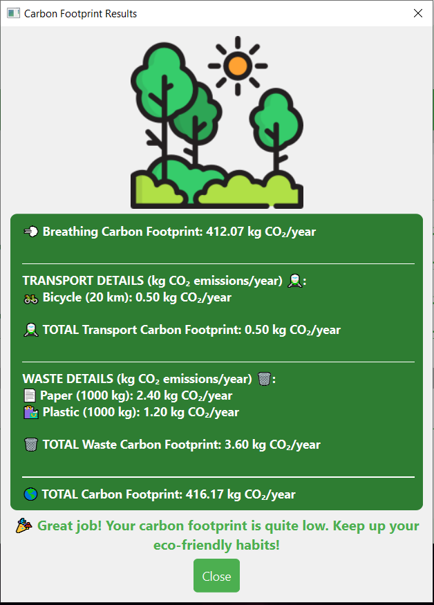
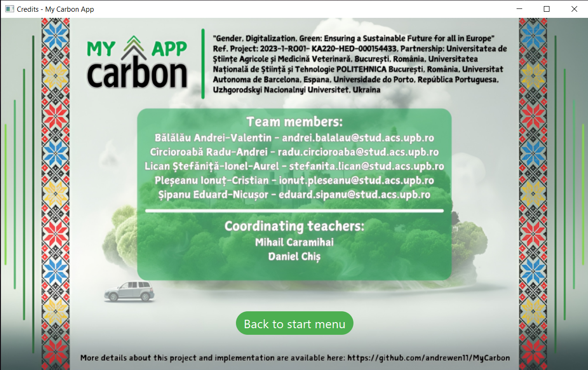

# My Carbon App - Carbon Footprint Calculator

`My Carbon App` is a desktop application designed to help users calculate their annual carbon footprint. The application considers various factors from daily life, including breathing, transportation, waste, and diet, to provide a total estimate of CO₂ emissions.

This project was developed within the Erasmus+ program "Gender, Digitalization, Green: Ensuring a Sustainable Future for all in Europe"

## Project Context

This project is the result of an international academic partnership between the following universities:
* University of Agricultural Sciences and Veterinary Medicine of Bucharest, Romania
* National University of Science and Technology POLITEHNICA Bucharest, Romania
* Autonomous University of Barcelona, Spain
* University of Porto, Portugal
* Uzhhorod National University, Ukraine

## Features

* **Modular Calculator:** Calculates the carbon footprint based on three main categories: Individual, Home, and Diet.
* **Individual Details:** Includes calculations for emissions from breathing and transportation methods (Personal Car, Public Transport, Bicycle, Scooter, Walking).
* **Waste Details:** Estimates annual CO₂ emissions from paper and plastic waste.
* **Clear Results:** Displays a detailed summary of the total carbon footprint (in kg CO₂/year).
* **Personalized Feedback:** Provides the user with an encouraging message based on their results.

## Screenshots

| First Page | Calculator |
| :---: | :---: |
|  | 
| Results | Credits |
| :---: | :---: |
 |  |

## Technologies Used


This project is developed using:
* **Programming Language:** C++
* **UI Framework/Library:** Qt


### Installation & Running

1.  Clone this repository:
    ```bash
    git clone https://github.com/CristianIonut7/MyCarbon
    ```
2.  Navigate to the project directory:
    ```bash
    cd MyCarbon/CarbonFootprintCalculator/MyCARBON_APP/Application
    ```
3.  Run the application:
    ```bash
    ./CarbonFootprintCalculator.exe
    ```

## Development Team

### Team Members (Students)
* **Bălălău Andrei-Valentin** - `andrei.balalau@stud.acs.upb.ro`
* **Ciorcioroabă Radu-Andrei** - `radu.ciorcioroaba@stud.acs.upb.ro`
* **Lican Ștefăniță-Ionel-Aurel** - `stefanita.lican@stud.acs.upb.ro`
* **Pleșeanu Ionuț-Cristian** - `ionut.pleseanu@stud.acs.upb.ro`
* **Șipanu Eduard-Nicușor** - `eduard.sipanu@stud.acs.upb.ro`

### Coordinating Teachers
* Mihail Caramihai
* Daniel Chiș
